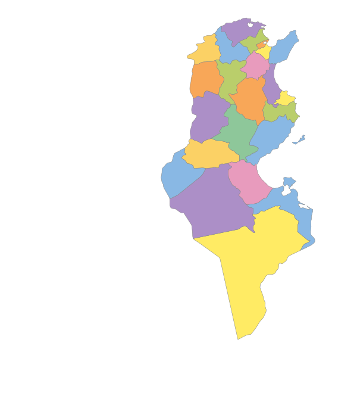

# Interactive Map of Tunisia 🇹🇳

[](https://developer.mozilla.org/en-US/docs/Web/HTML)
[](https://developer.mozilla.org/en-US/docs/Web/CSS)
[](https://developer.mozilla.org/en-US/docs/Web/JavaScript)
[](#)

An educational web project that presents an **interactive SVG map** of Tunisia’s **24 governorates**.

Users can:
- hover over a governorate to view key information,
- click a governorate to open its dedicated detail page,
- explore national statistics and regional grouping.

## Live Demo

If GitHub Pages is enabled, the project is available at:

**https://ahmed-abid-24.github.io/Interactive-map-of-Tunisia/**

## Preview



## Features

- Interactive SVG map of Tunisia
- 24 clickable governorates
- Hover information panel (region, population, area, density, etc.)
- Dedicated HTML page for each governorate
- Tunisia summary statistics section
- Organized assets (CSS, JavaScript, images, pages)

## Tech Stack

- HTML5
- CSS3
- Vanilla JavaScript (no framework)

## Project Structure

```text
.
├── index.html
├── css/
│   ├── carte.css
│   ├── gouvernorat.css
│   └── style.css
├── js/
│   ├── carte.js
│   └── data.js
├── images/
│   ├── carte/
│   ├── gouvernorats/
│   └── icons/
└── pages/
    └── gouvernorats/
        ├── ariana.html
        ├── beja.html
        ├── ...
        └── zaghouan.html
```

## Getting Started

### 1) Clone the repository

```bash
git clone https://github.com/ahmed-abid-24/Interactive-map-of-Tunisia.git
cd Interactive-map-of-Tunisia
```

### 2) Run locally

Because this is a static project, you can open `index.html` directly in your browser.

For a better development experience, use a local server (recommended):

- VS Code + Live Server extension, or
- Python:

```bash
python -m http.server 8000
```

Then open: `http://localhost:8000`

## How It Works

- Map interactions are handled in `js/carte.js`.
- Governorate and national data are stored in `js/data.js`.
- Clicking a governorate redirects to its page under `pages/gouvernorats/`.

## Language

The current user interface content is mainly in French.

## Contributing

Contributions are welcome.

1. Fork the project
2. Create a feature branch
3. Commit your changes
4. Open a Pull Request

## License

This project does not currently include a license file.
If you plan to make it open-source, consider adding an MIT license.
